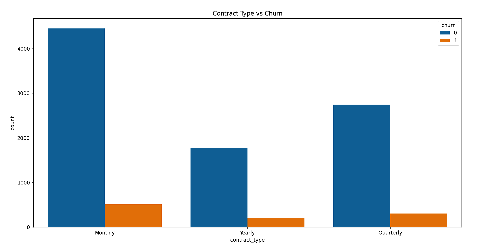
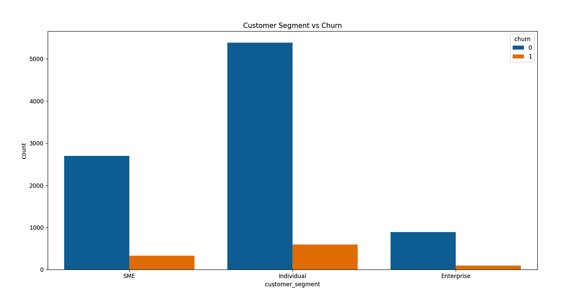
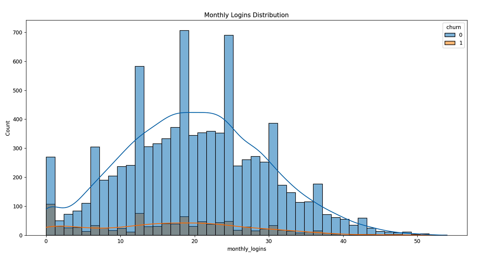
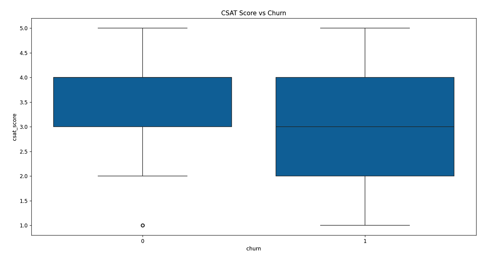
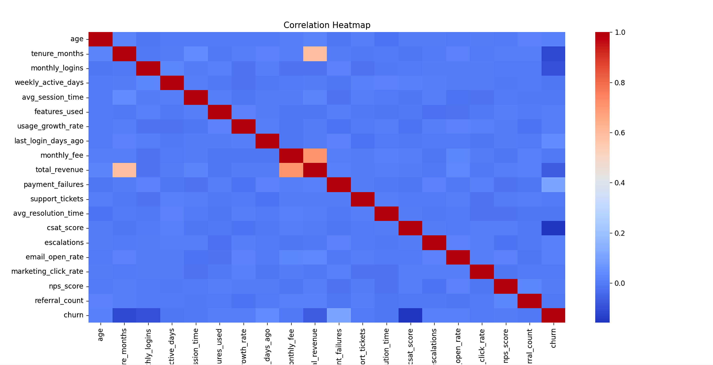

# Customer Churn Analysis Project

## 📌 Project Overview

This project focuses on analyzing customer churn behavior using Python, Pandas, Matplotlib, and Seaborn.

The goal of this project is to identify the key factors responsible for customer churn and generate business insights that can help companies improve customer retention.

The dataset contains customer demographic information, engagement behavior, subscription details, support interactions, and satisfaction scores.

---

# 🎯 Objectives

- Analyze customer churn patterns
- Identify high-risk customer groups
- Understand the impact of customer engagement on churn
- Study customer satisfaction and retention
- Generate business insights using data visualization
- Improve decision-making using analytics

---

# 🛠️ Tools & Technologies Used

- Python
- Pandas
- NumPy
- Matplotlib
- Seaborn
- PyCharm
- GitHub

---

# 📊 Key Analysis Performed

### 1. Contract Type vs Churn
Analyzed how different subscription plans affect customer churn.

### 2. Customer Segment vs Churn
Compared churn across SME, Enterprise, and Individual customers.

### 3. Monthly Logins Distribution
Studied customer engagement behavior using login frequency.

### 4. CSAT Score vs Churn
Analyzed customer satisfaction scores and their impact on retention.

### 5. Correlation Heatmap
Identified relationships between numerical variables affecting churn.

---

# 📷 Project Screenshots

## Contract Type vs Churn


## Customer Segment vs Churn


## Monthly Logins Distribution


## CSAT Score vs Churn


## Correlation Heatmap


---

# 💡 Business Insights

### 🔹 Monthly contract customers showed higher churn rates
This indicates that long-term contracts improve customer retention.

### 🔹 Customers with low monthly logins were more likely to churn
Lower engagement often leads to customer drop-off.

### 🔹 Lower CSAT scores strongly impacted churn
Unsatisfied customers are more likely to leave the platform.

### 🔹 Individual customers had higher churn compared to Enterprise customers
Enterprise customers tend to stay longer due to larger commitments.

### 🔹 Strong relationships were observed between engagement metrics and churn
Customer activity plays a major role in retention.

---

# 🚀 Conclusion

The analysis shows that customer engagement, contract type, and customer satisfaction are major drivers of churn.

Businesses can reduce churn by:
- improving customer support,
- increasing engagement,
- offering long-term subscription benefits,
- and monitoring satisfaction scores regularly.

---

# 📂 Project Structure

```
CustomerChurnPredictionAnalysis/
│
├── customer_churn_business_dataset.csv
├── main.py
├── README.md
├── images/
└── charts/
```

---

# 👩‍💻 Author

Tanishka Saini

Aspiring Data Analyst | Python | SQL | Data Visualization